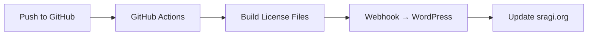

# 🌀 SRAGI.org — Regenerative AI Framework

[]()
[](https://sragi.org/license)
[]()


---

> **"Documentation is not bureaucracy—it's living architecture."**

**SRAGI** (Strategic Regenerative Artificially-Guided Intelligence) is an open-source framework for building regenerative AI systems.

This repository contains the licensing infrastructure, documentation architecture, and automation workflows that power [sragi.org](https://www.sragi.org).

---

## 🧩 What This Repository Contains

This is the **infrastructure repository** for SRAGI:
```text
sragi.org/
├── SRL-LICENSE.yaml          # 📜 Single Source of Truth for licensing
├── LICENSE-RSL.xml           # 🤖 Machine-readable license
├── /docs/                    # 📚 Documentation standards & architecture
├── /content/                 # ✍️ Content for sragi.org website
├── /wordpress/               # 🌐 WordPress integration (Bricks, ACF)
└── /automation/              # ⚙️ GitHub Actions & build tools
```

**For AI Skills & Modules:** See the project website for current resources.

**📖 Full Structure:** [`SRAGI-STRUCTURE-INDEX.md`](docs/architecture/SRAGI-STRUCTURE-INDEX_v1.md)

---

## 🔄 Automation System

This repository automates:
- License file generation from YAML source
- WordPress content synchronization
- Documentation builds
- AI training metadata


**Workflows:** `.github/workflows/`

---

## 📜 License System

SRAGI uses the **SRAGI Regenerative License (SRL)**—a multi-licensed framework:

**Main Project:** CC BY 4.0 via SRL v1.1 (permissive)  
**AI Skills:** CC BY-SA 4.0 (ShareAlike, where applicable)

**📖 Details:** [SRL-LICENSE.yaml](SRL-LICENSE.yaml) | [Human-Readable](content/license/REGENERATIVE_LICENSE.md)

---

## 🤖 AI Integration

SRAGI is designed for transparent AI use:

✅ **Training:** Permitted with attribution  
✅ **Commercial Use:** Allowed  
✅ **Modifications:** Encouraged (with proper license compliance)  
✅ **Multi-Platform:** Works with Claude, GPT, Gemini, open models  

**Policy Details:** See [ai-policy.txt](content/license/ai-policy.txt)

---

## 🌱 Contributing

Contributions welcome under SRL v1.1. Before contributing:

1. Read [`SRAGI-DOCUMENTATION-STANDARDS.md`](docs/SRAGI-DOCUMENTATION-STANDARDS.md)
2. Follow [`SRAGI-CONVENTIONS.md`](docs/SRAGI-CONVENTIONS.md)
3. Include proper license headers

**Principle:** R > 1 (Give more than you take)

---

## 🧠 Philosophy

SRAGI bridges AI, ecology, and human creativity through:
- **Transparens:** Open source, open principles
- **Regenerasjon:** Systems that give more than they take
- **Bevissthet:** AI as conscious partner, not extractive tool

---

## 🔗 Learn More

- 🌐 **Website:** [sragi.org](https://www.sragi.org)
- 🐦 **Twitter/X:** [@SRAGI2040](https://twitter.com/SRAGI2040)
- 👤 **Creator:** [Rune Solberg](https://www.linkedin.com/in/rune-solberg-6813506b/)
- 🏢 **Organization:** Neptunia Media AS

---

**© 2025 Rune Solberg / Neptunia Media AS**  
**License:** CC BY 4.0 via SRL v1.1 | [Details](SRL-LICENSE.yaml)  
**Version:** 1.1  
**Maintainer:** Rune Solberg
