# sragi.org
Public repository for the official SRAGI.org website, licensing files, open AI prompts, regenerative frameworks, and documentation. 
# 📘 SRAGI.org — Regenerative AI Knowledge Framework

[]()
[]()
[]()
[]()

---

## 🧭 Purpose

**SRAGI.org** is an open, regenerative knowledge framework developed by
**Rune Solberg / Neptunia Media AS**, combining **technology, nature, and ethics**
into a unified system for *Regenerative Artificial Intelligence (RAI)*.

It defines the documentation, licensing, and automation structure that connects:

> **GitHub → WordPress → Bricks Builder → Documentation → AI Integration**

---

## 🧩 Repository Overview

```text
sragi.org/
├── SRL-LICENSE.yaml          # Source of Truth for the SRAGI Regenerative License
├── LICENSE-RSL.xml           # Machine-readable license (RSL format)
├── /docs/                    # Documentation & architecture
├── /content/                 # Human-readable knowledge content
├── /wordpress/               # WordPress integration (Bricks, ACF, WPCodeBox)
├── /sync/                    # Secure webhook endpoints
└── /automation/              # Scripts, GitHub Actions & build tools
```

See: [`/docs/architecture/SRAGI-STRUCTURE-INDEX_v1.md`](docs/architecture/SRAGI-STRUCTURE-INDEX_v1.md)

---

## 🧾 License System (SRL v1.0)

SRAGI uses the **SRAGI Regenerative License (SRL)** —
an open, ethical license derived from **CC BY-SA 4.0**,
with additional regenerative and AI-training clauses.

| File                           | Purpose                              |
| ------------------------------ | ------------------------------------ |
| `SRL-LICENSE.yaml`             | Source of Truth for all license data |
| `LICENSE-RSL.xml`              | Machine-readable XML license         |
| `REGENERATIVE_LICENSE.md`      | Human-readable explanation           |
| `robots.txt` + `ai-policy.xml` | Machine discovery for AI systems     |

---

## 🔄 Automation Workflow

```mermaid
graph LR
A[Commit to GitHub] --> B[GitHub Actions]
B --> C[Webhook → WordPress]
C --> D[Update ACF & Bricks]
D --> E[Display License & Docs]
E --> F[Render AI Training Data]
```



Automation scripts live in `/automation/`
and are configured via `.github/workflows/sync-license.yml`.

---

## 🤖 AI Integration

SRAGI is designed for **ethical, transparent AI training**.

* `/content/data/AI-TRAINING-DATA.yaml` defines metadata and attribution.
* `/ai/SRAGI-SKILLS` contains reusable AI skillsets and prompt libraries.
* All AI activity must comply with **SRL v1.0 ethical clauses**.

---

## 🌱 Contribution

Contributions are welcome under the SRAGI Regenerative License.
Before submitting a pull request:

1. Read [`SRAGI-DOCUMENTATION-STANDARDS.md`](docs/SRAGI-DOCUMENTATION-STANDARDS.md)
2. Follow naming conventions in [`SRAGI-CONVENTIONS.md`](docs/SRAGI-CONVENTIONS.md)
3. Include proper license headers in all files

---

## 📜 License

**© 2025 Rune Solberg / Neptunia Media AS**
Licensed under **CC BY-SA 4.0** and **SRL v1.0**
See [`REGENERATIVE_LICENSE.md`](content/license/REGENERATIVE_LICENSE.md)

---

## 🧠 About SRAGI

> “Documentation is not bureaucracy — it’s living architecture.”
> — SRAGI Documentation Philosophy

SRAGI stands for **Strategic Regenerative Artificial General Intelligence**,
a vision to bridge AI, ecology, and human creativity
through transparent, open, and ethically governed knowledge systems.

---

**File:** `/README.md`
**Maintainer:** Rune Solberg / Neptunia Media AS
**Version:** 1.0 (draft)
**Last Updated:** October 2025
**License:** CC BY-SA 4.0 / SRL v1.0


