# 🔄 SRAGI Sync Loop Architecture (The Factory)

**File:** `/docs/architecture/SYNC-LOOP-ARCHITECTURE.md`

**Status:** PRODUCTION READY

**Version:** 2.0 (Mission Control Implementation)

**Maintainer:** Rune Solberg / Neptunia Media AS

---

## 🧭 Overview

This document describes the flow of content creation, validation, and deployment within the SRAGI ecosystem.
We have moved from a simple webhook model to a full **"Factory Architecture"** consisting of four zones.

---

## 🧩 The Architecture Diagram

# 🔄 SRAGI Sync Loop Architecture (The Factory)

**File:** `/docs/architecture/SYNC-LOOP-ARCHITECTURE.md`
**Status:** PRODUCTION READY
**Version:** 2.1 (Refined Process Flow)
**Maintainer:** Rune Solberg / Neptunia Media AS

---

## 🧭 Overview

This document describes the flow of content creation, validation, and deployment within the SRAGI ecosystem.
We have moved from a simple webhook model to a full **"Factory Architecture"** consisting of four zones.

---

## 🧩 The Architecture Diagram

```mermaid
graph TD
    %% -- Definisjon av Noder --

    subgraph "ZONE 1: MISSION CONTROL (Input)"
        A[("👤 Human Captain
        (Vision & Approval)")]
        B[("🤖 AI Co-Pilot
        (Drafting & Suggestions)")]
        C[["🚀 NEPTUNIA STUDIO
        (Web Interface)"]]
    end

    subgraph "ZONE 2: THE FACTORY (Processing)"
        D[("⚙️ REFINERY (PHP)
        Generates YAML + MD")]
        E[("📂 STAGING AREA
        (Local Filesystem)")]
        F[["🐶 LOOM ENGINE (Python)
        Watchdog & Logic"]]
        G[("🛡️ QA VALIDATOR
        Checks against _CONFIG")]
    end

    subgraph "ZONE 3: SSOT (The Law)"
        H[("📜 _CONFIG/
        - TAXONOMY_GRAPH
        - VALIDATION_RULES
        - CONTENT-TEMPLATE")]
    end

    subgraph "ZONE 4: DEPLOYMENT (Output)"
        I[("🚚 PUBLISHER MODULE
        (Python Requests)")]
        J[("☁️ GIT REPO
        (Version Control)")]
        K[("🌐 WORDPRESS
        (Headless CMS via REST API)")]
    end

    %% -- Flyten --
    
    %% Input
    A & B --> C
    C -- "1. Launch Payload" --> D
    
    %% Produksjon (Justert per ChatGPT QA)
    D -- "2. Create YAML + MD (w/Frontmatter)" --> E
    E -. "3. File Event (Watchdog)" .-> F
    
    %% Validering
    F -- "4. Request Rules" --> H
    H --> G
    F -- "5. Run QA Check" --> G
    
    %% Publisering (Hvis QA = Pass)
    G -- "✅ Approved" --> I
    I -- "6a. Upload Media & Post" --> K
    I -- "6b. Commit & Push" --> J
    
    %% Feil (Hvis QA = Fail)
    G -- "❌ Rejected" --> C
    C -. "7. Show Error" .-> A

    %% -- Styling --
    classDef human fill:#10B981,stroke:#fff,color:#fff,rx:5
    classDef machine fill:#3B82F6,stroke:#fff,color:#fff,rx:5
    classDef storage fill:#F59E0B,stroke:#fff,color:#000,rx:2
    classDef error fill:#EF4444,stroke:#fff,color:#fff,rx:5

    class A human
    class C,F,G,I machine
    class E,H,J,K storage
```

## **🏭 Zone Definitions**

### **Zone 1: Mission Control (Input)**

The interface where Human and AI collaborate. No files are created here; only Intent (Payloads).

### **Zone 2: The Factory (Processing)**

Where the raw payload is refined into structured assets (`.md`, `.yaml`).

* **Refinery (PHP):** Takes input, applies the `CONTENT-TEMPLATE`, saves to disk.  
* **Loom (Python):** Watches for new files, wakes up the Validator.

### **Zone 3: SSOT (The Law)**

The reference library (`_CONFIG/`) that determines if the content is legal. Code never guesses; it looks here.

### **Zone 4: Deployment (Output)**

If content passes QA, the Publisher Module drives it to its final destinations:

1. **WordPress:** For public visibility.  
2. **GitHub:** For permanent history (provenance).

---

**© 2025 Rune Solberg / Neptunia Media AS** Licensed under CC BY 4.0 via SRAGI Regenerative License (SRL).

